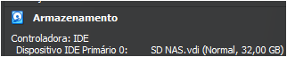

# **Trabalho de Sistemas Distribuídos**  
## Relatório da Implementação de Sistema de Arquivos  
Ivia Marques Pereira Costa  
João Victor Peluci G de S Valente  
Laura Campos  

# Introdução
O armazenamento de dados é um elemento essencial na era digital, sendo fundamental tanto para usuários domésticos quanto para empresas de diversos portes. A busca por soluções que ofereçam segurança, fácil usabilidade e autonomia tem levado ao desenvolvimento de alternativas que fogem do modelo centralizado em grandes provedores de serviços, como a Amazon, Azure, Microsoft e Google. Nesse contexto, tecnologias NAS - Network-Attached Storage vêm à tona, pois permitem a criação de sistemas de armazenamento distribuído acessíveis e eficientes de forma ‘artesanal’.
A implementação de uma solução baseada no TrueNAS permite explorar conceitos de descentralização, garantindo maior controle sobre os dados e promovendo a privacidade dos usuários/empresas que os utilizam. No entanto, a adoção desse tipo de sistema pode apresentar desafios, como a complexidade de configuração e limitações em funcionalidades específicas, que muitas vezes estão disponíveis apenas em versões pagas da plataforma, como o TrueNAS Scale. Além disso, apesar de simples de utilizar, não são plug-and-play como as soluções das gigantes tecnológicas citadas, obrigando que a configuração seja feita por pessoas especializadas.

---

# Objetivos
O projeto tem como objetivo geral a implementação de uma plataforma para a gestão de arquivos pessoais. Para alcançar esse propósito, foram definidos objetivos específicos que abrangem aspectos fundamentais do sistema, tais como:
- Assegurar a tolerância a falhas do sistema de arquivos;
- Garantir a escalabilidade vertical da solução;
- Viabilizar o acesso remoto aos arquivos armazenados;
- Explorar ferramentas Open-Source;
- Proporcionar uma implementação que contribua para o aprofundamento dos conhecimentos em Sistemas Distribuídos.


---

# Materiais
Para desenvolvimento do projeto, foram utilizados:
- Um computador com acesso à internet e pelo menos 100GB disponíveis;
- Um ou mais dispositivos móveis com acesso à internet;
- Sistema operacional TrueNAS Core em formato ISO;
- Software Oracle VM VirtualBox;
- Software VPN ZeroTier.

---

# Desenvolvimento
## Download do sistema operacional do NAS
O primeiro passo foi a escolha do TrueNAS, sistema operacional para servidores NAS (Network-Attached Storage). O download da ISO foi feito diretamente do [site oficial](https://www.truenas.com/), uma vez que a versão community é gratuita e open-sourced.


Imagem 1: Site TrueNAS

## Escolha da máquina utilizada no projeto
Para continuação do projeto, foi decidido em qual máquina seria instalado o sistema operacional NAS. A escolha deveria ser feita entre instalação em um computador dedicado para o servidor - que seria mais custoso - ou em uma máquina virtual. Dado que o servidor será usado somente para a disciplina, optamos pela segunda opção e instalamos o software [Oracle VM VirtualBox](https://www.virtualbox.org/wiki/Downloads).


Imagem 2: Software Oracle VM VirtualBox em execução

## Configuração da Máquina
Foi feita a configuração da máquina virtual usando as seguintes especificações:
- Memória RAM: 8192 MB
- Processadores: 8 núcleos
- Disco Rígido principal: 32GB



Imagem 3: Especificações da Máquina Virtual

Antes de iniciar a máquina pela primeira vez, colocamos a ISO dentro do disco rígido da máquina.

## Instalação do Sistema Operacional
A instalação do sistema operacional é feita por meio de um passo a passo dentro do terminal. O processo levou cerca de 4h para ser executado. Ao final desse processo, o sistema já pode ser inicializado e executado.

## Criação dos usuários e permissões
Nesta etapa, criamos usuários e permissões no sistema TrueNAS. Isso é necessário porque o sistema pode ser utilizado por múltiplos usuários na mesma rede. Com os usuários criados, além do usuário root, podemos gerenciar as permissões de leitura e escrita no sistema, garantindo segurança e privacidade para o sistema.


Imagem 4: Criação de usuários e permissões

## Criação de novos discos de armazenamento
Após a criação dos usuários, é preciso efetivamente configurar os HDs que farão parte do sistema. Entenda que, nessa etapa, é onde entraria a decisão de espaço de armazenamento total que seria necessário e a relação entre a redundância desse armazenamento a fim de criar um sistema mais robusto e tolerante a falhas. Nessa etapa, criamos dois HDs, cada um com 20GB.


Imagem 5: Criação dos discos virtuais

## Criação de uma Pool de Armazenamento
Usando os discos rígidos acima, criamos uma Pool de arquivos RAID 1, que espelha o conteúdo dos HDs envolvidos, garantindo maior segurança aos arquivos.


Imagem 6: Criação da Pool de Arquivos

## Testagem do NAS
A funcionalidade principal de um servidor NAS é o armazenamento de arquivos. Para testar o NAS, queremos verificar três pilares principais: velocidade, integridade e estabilidade.

### Teste de Upload
Foi realizada a transferência de arquivos para a máquina. Para isso, criamos três arquivos diferentes e realizamos o upload deles. Após isso, oscilamos a rede e reiniciamos a máquina, garantindo que não houvesse perda de dados.

### Teste de Download
O download de arquivos armazenados no NAS foi testado a partir de uma máquina diferente, conectada na mesma rede. As conclusões foram:
- Velocidade: Depende da rede que se encontra.
- Integridade: Os arquivos ainda estavam dentro do NAS e conseguiram ser baixados.
- Estabilidade: Em caso de oscilção da rede, o arquivo não era baixado e exigia reconexão à máquina.


Imagem 7: Testes de desempenho da máquina NAS

## Instalar o ZeroTier no sistema NAS
Para permitir o acesso remoto ao NAS, é preciso utilizar uma VPN para expor publicamente o endereço, mas sem comprometer a segurança dos dados. Isso é feito por meio do ZeroTier, que é uma VPN que configura uma rede privada e gratuita para até 10 dispositivos. O ZeroTier usa uma arquitetura mista de SDN e Peer-To-Peer para garantir a privacidade e a confidencialidade na rede. A primeira etapa é a instalação do Zerotier na máquina. Primeiro, realizamos o acesso via SSH.


Imagem 8: Terminal da máquina NAS em acesso SSH


```bash
sed -i .orig 's/enabled: yes/enabled: no/' /usr/local/etc/pkg/repos/local.conf
sed -i .orig 's/enabled: no/enabled: yes/' /usr/local/etc/pkg/repos/FreeBSD.conf
pkg update
pkg install -y zerotier
service zerotier onestatus
service zerotier onestart
Mover para um sistema de arquivos persistente
mkdir -p /mnt/cefetmg/zerotier/db/
mv /var/db/zerotier-one/* /mnt/cefetmg/zerotier/db/
/sbin/mount_nullfs /mnt/cefetmg/zerotier/db/ /var/db/zerotier-one
ls -1 /var/db/zerotier-one
```

## Criação de uma conta no ZeroTier
Após ter instalado o Zerotier na máquina NAS, é preciso configurá-lo para redirecionamento para a rede VPN correta. Usando o portal web do Zerotier, criamos uma conta gratuita e copiamos o seu endereço hash, para que possa ser usado nas próximas configurações da máquina NAS e dos dispositivos que vão acessá-las.


Imagem 9: Interface do ZeroTier configurada

## Conectar o TrueNAS à rede ZeroTier
Para conectar o sistema à rede, basta executar scripts no terminal da máquina e, posteriormente, autorizar o acesso do dispositivo à rede. Esse tipo de autorização só pode ser feita pela interface, o que é restringido por uma senha de acesso e autenticação de 2 fatores.

```bash
zerotier-cli join <NETWORK-ID> - O network ID encontra-se na imagem 9
zerotier-cli info
cp /usr/local/etc/rc.d/zerotier /mnt/cefetmg/zerotier/zerotier.rc.d
```

## Conectar um dispositivo móvel para acessar remotamente o NAS
Tendo feito todas as configurações acima, já deve ser possível conectar outros dispositivos à rede utilizando a VPN Zerotier. Nessa etapa, o download do aplicativo Zerotier One deve ser feito e a sua autorização também deve ser feita na interface


Imagem 10: ZeroTier One em execução no dispositivo Android

## Testes finais
Para verificar o funcionamento da máquina, fizemos o upload dos checkpoints 1, 2 e 3 no disco rígido do NAS. Feito o acesso pelo aplicativo ZeroTier Acessando pelo aplicativo Meus Arquivos da Samsung, bastou usar o IP da máquina remota para acessar o cliente web de configuração da máquina. Abaixo, a foto descreve o funcionamento correto e remoto, visto que o dispositivo está no 5G e a rede está configurada em um wifi doméstico.

 
Imagem 11: Interface Web TrueNAS acessada por VPN 

Além disso, é claro, conseguimos fazer o download de arquivos que estavam na máquina usando aplicativos nativos do Android, iOS e Windows, que se conectam pelo protocolo SMB. 


Imagem 12: TrueNAS sendo acessado como unidade de rede remotamente

## Configurar script de boot no TrueNAS
Para que o TrueNAS sempre seja acessível externamente pela ZeroTier, é preciso que um script de inicialização rode sempre que a máquina seja iniciada. Os scripts são:
```
curl https://alan.norbauer.com/articles/zerotier-on-truenas/scripts/zerotier-start.sh -o /mnt/cefetmg/zerotier/zerotier-start.sh
chmod +x /mnt/cefetmg/zerotier/zerotier-start.sh
```
Após o download dos scripts, no menu da ferramenta existe a opção para selecionar scripts para executarem durante o boot. Deve-se selecionar o zerotier-start.sh.

---

# Resultados
Após a realização das configurações necessárias, foi possível acessar os arquivos em diversos dispositivos. Para verificar o pleno funcionamento da rede, os testes foram realizados em três sistemas operacionais distintos: Windows, utilizado como sistema hospedeiro da máquina virtual TrueNAS; iOS, conhecido por suas restrições quanto a personalizações pelos usuários; e Android, que oferece maior liberdade de customização de forma nativa. Em todas as plataformas testadas, os resultados foram satisfatórios, permitindo o acesso consistente aos arquivos.
No entanto, apesar do sucesso na conectividade entre os dispositivos, observou-se uma limitação significativa na velocidade de rede. A taxa máxima de upload registrada foi de apenas 2 Mbps, mesmo em uma infraestrutura de internet com capacidade superior a 500 Mbps, evidenciando uma das principais limitações de um NAS caseiro.
Um aspecto positivo identificado pelo grupo foi o método de distribuição segura de arquivos utilizando o ZeroTier. A plataforma oferece recursos avançados de segurança, exigindo a autorização prévia de todos os dispositivos que desejam acessar a rede, o que proporciona um alto nível de confiabilidade. Entretanto, a configuração do ZeroTier no TrueNAS apresentou desafios devido às restrições da versão gratuita, o que exigiu ajustes adicionais durante a implementação.

---

# Conclusão
Este trabalho proporcionou ao grupo uma compreensão aprofundada sobre sistemas de arquivos distribuídos, permitindo a aplicação prática de conceitos abordados na disciplina, como redes P2P (peer-to-peer), escalabilidade vertical — por meio da adição de discos rígidos ao servidor NAS —, além de aspectos relacionados à privacidade e segurança de acesso, utilizando VPNs privadas, entre outros tópicos discutidos ao longo do relatório. Embora o projeto tenha proporcionado um aprendizado significativo, foi identificado que a versão Open-Source gratuita do TrueNAS apresentou certas limitações que dificultaram a implementação, desafios que poderiam ter sido minimizados com recursos adicionais disponíveis em versões pagas.
